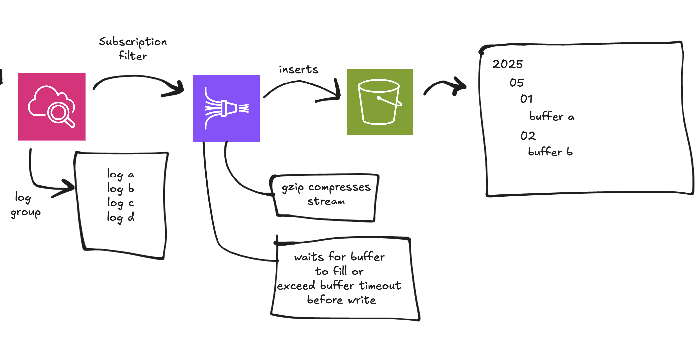

# cloudwatch-to-s3

Terraform-based infrastructure that mimics a CloudWatch -> Kinesis Firehose -> S3 ingestion pattern.

## Architecture

ALT: A diagram showing (left-to-right) the ingestion pattern from a CloudWatch log group to Kinesis Firehose (via a subscription filter) to S3 - which is partitioned by date.

## Usage

Ensure you have AWS credentials setup.

Run the following comamnds from the root of this repository:
- `terraform init` (initialises backend state)
- `terraform apply` (creates a plan to deploy the infrastructure)
    - when prompted, enter `yes` (this will create resources in AWS!)

Go to AWS -> CloudWatch, click on the log group created, go to the log stream, click `Create log event` in the `Actions` dropdown.

Once the log event has been created, it will take 60s for it to be ingested into S3 via Kinesis Firehose.

## Destroy

To destroy the infrastructure, run `terraform destroy` (enter yes when prompted).

## Disclaimer

The information provided on this repository is for general informational purposes only. I assume no responsibility for errors or omissions in the content or for any actions taken based on the information provided.